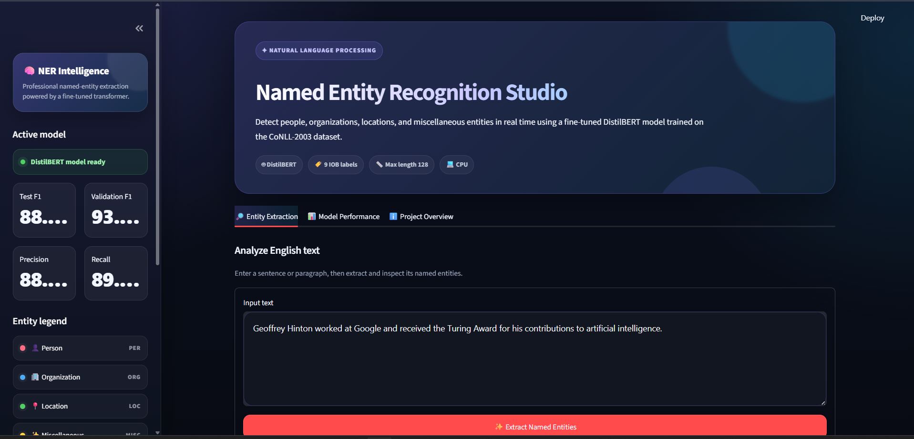
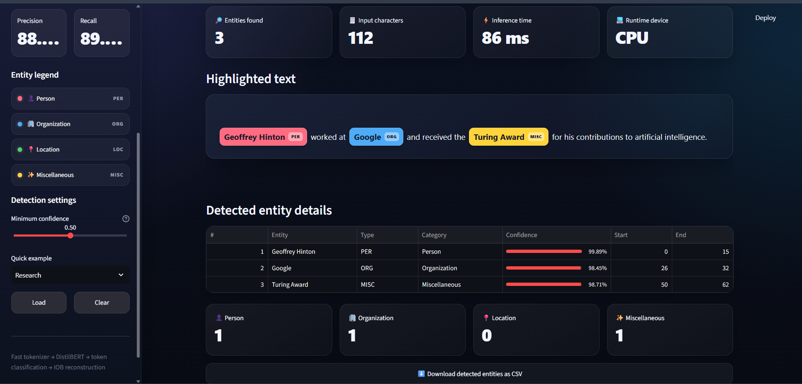

<div align="center">

# 🧠 Named Entity Recognition System

### End-to-End NER with LSTM, BiLSTM, BiLSTM-CRF, and DistilBERT

A complete Natural Language Processing project for detecting **people, organizations, locations, and miscellaneous named entities** in English text using traditional deep-learning architectures and a fine-tuned Transformer model.

<br>


</div>

---

## 📌 Project Overview

This project implements a complete **Named Entity Recognition (NER)** pipeline using the **CoNLL-2003** dataset.

The system recognizes four entity categories:

| Code | Entity Type | Example |
|:---:|---|---|
| `PER` | Person | Elon Musk |
| `ORG` | Organization | Microsoft |
| `LOC` | Location | Washington |
| `MISC` | Miscellaneous | European Union |

The project covers the full machine-learning lifecycle:

- Exploratory data analysis
- Text and label preprocessing
- Word and character vocabulary construction
- GloVe embedding integration
- Character-level CNN feature extraction
- LSTM and BiLSTM sequence modeling
- Linear-chain CRF decoding
- DistilBERT fine-tuning
- Entity-level evaluation with Seqeval
- Interactive deployment with Streamlit

---

## ✨ Main Features

- Four trained NER architectures
- Character-level features for handling unseen words
- Pre-trained GloVe word embeddings
- Custom linear-chain CRF implementation
- Fast tokenizer with correct subword-to-word alignment
- Confidence-based entity filtering
- Colored entity highlighting
- Entity positions and confidence scores
- CSV export for extracted entities
- Model-performance comparison dashboard
- Responsive Streamlit interface
- Local Transformer loading without internet access

---

## 🖼️ Application Preview

### Home Interface


### Entity Extraction Result


---

## 🏆 Model Performance

All models were evaluated on the CoNLL-2003 test split using entity-level metrics.

| Model | Precision | Recall | Test F1 |
|---|---:|---:|---:|
| LSTM | 74.07% | 78.90% | 76.41% |
| BiLSTM | 82.84% | 84.19% | 83.51% |
| BiLSTM + CRF | 84.47% | 84.74% | 84.60% |
| **DistilBERT** | **88.20%** | **89.14%** | **88.67%** |

> **DistilBERT achieved the strongest overall test performance with an F1 score of 88.67%.**

### DistilBERT Performance by Entity Type

| Entity Type | Precision | Recall | F1 |
|---|---:|---:|---:|
| PER | 95.24% | 94.12% | 94.67% |
| LOC | 90.46% | 91.06% | 90.76% |
| ORG | 83.97% | 87.06% | 85.49% |
| MISC | 77.29% | 78.06% | 77.68% |

---

## 📊 Dataset

The project uses the **CoNLL-2003 Named Entity Recognition dataset**.

| Split | Sentences |
|---|---:|
| Training | 14,041 |
| Validation | 3,250 |
| Test | 3,453 |

### IOB2 Label Set

```text
O
B-PER
I-PER
B-ORG
I-ORG
B-LOC
I-LOC
B-MISC
I-MISC